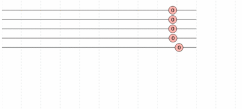

# rx-vis

rx-vis is a live [rxjs marble diagram](http://rxmarbles.com/) that shows data streams visualization. 
You can use it when debugging the output stream of your `Rx.Observable` instances.

## Features

- data is represented by circles moving from right to left
- 

## Getting Started

Provide installation instructions, general usage guidance, API examples, and build and deployment information. Assume as little prior knowledge as possible, describing everything in clear and coherent steps. Avoid words such as "just" and "simple," which can be off putting to users who do not understand the instructions.

### Installation/Dependencies

- d3.min.js
- Rx.min.js
- d3-scale-chromatic.min.js
- md5.min.js

How does a user get up and running with your project? What dependencies does the project have? Aim to describe these in clear and simple steps. Provide external links

### Usage

Provide clear examples of how the project may be used. For large projects with external documentation, provide a few examples and link to the full docs here.

### Build/Deployment

If the user will be building or deploying the project, add any useful guidance.

## Getting Help

What should users do and expect when they encounter bugs or get stuck using your project? Set expectations for support, link to the issue tracker and roadmap, if applicable.

Where should users go if they have a question? (Stack Overflow, Gitter, IRC, mailing list, etc.)

If desired, you may also provide links to core contributor email addresses.

## Contributing Guidelines

Include instructions for setting up the development environment, code standards, running tests, and submitting pull requests. Aim to be inclusive and welcoming. It may be useful to link to a seperate CONTRIBUTING.md file. See this example from the Hoodie project as an exemplar: https://github.com/hoodiehq/hoodie/blob/master/CONTRIBUTING.md

## Code of Conduct

Open Source projects should follow a code of conduct. Provide a link to the Code of Conduct for your project. I recommend using the Contributor Covenant: http://contributor-covenant.org/

## License

Include a license for your project. If you need help choosing a license, use this guide: https://choosealicense.com/
